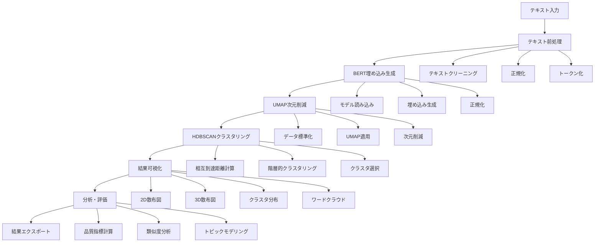
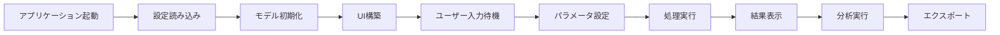

# BERT + UMAP + HDBSCAN Text Clustering Application

Advanced text clustering application using BERT embeddings, UMAP dimensionality reduction, and HDBSCAN clustering. This Streamlit-based web application provides an intuitive interface for analyzing and visualizing text clusters.

## 🚀 プロジェクト概要

このアプリケーションは、自然言語処理（NLP）の最新技術を組み合わせた高度なテキストクラスタリングシステムです。BERTによる意味的埋め込み、UMAPによる次元削減、HDBSCANによる密度ベースクラスタリングを統合し、テキストデータの自動的な分類と可視化を実現します。

## 📋 目次

- [機能](#機能)
- [アルゴリズム詳細](#アルゴリズム詳細)
- [ファイル構成](#ファイル構成)
- [プログラムフロー](#プログラムフロー)
- [インストール](#インストール)
- [使用方法](#使用方法)
- [アーキテクチャ](#アーキテクチャ)
- [設定](#設定)
- [パフォーマンス](#パフォーマンス)
- [例](#例)
- [API リファレンス](#api-リファレンス)
- [トラブルシューティング](#トラブルシューティング)
- [貢献](#貢献)
- [ライセンス](#ライセンス)

## 機能

### 🧠 **BERT Embeddings**
- Multiple BERT model support (Sentence Transformers and raw BERT)
- High-quality text embeddings for semantic understanding
- Configurable model selection

### 🗺️ **UMAP Dimensionality Reduction**
- Efficient dimensionality reduction preserving local and global structure
- Configurable parameters (neighbors, minimum distance, components)
- Support for 2D and 3D visualizations

### 🔍 **HDBSCAN Clustering**
- Density-based clustering with noise detection
- Automatic cluster number determination
- Robust to outliers and varying cluster densities

### 📊 **Interactive Visualizations**
- 2D and 3D UMAP scatter plots
- Cluster distribution charts
- Word clouds for each cluster
- Interactive hover information

### 📈 **Advanced Analysis**
- Clustering quality metrics (Silhouette, Calinski-Harabasz, Davies-Bouldin)
- Text similarity analysis
- Topic modeling with LDA
- Export functionality

## アルゴリズム詳細

### 🤖 BERT (Bidirectional Encoder Representations from Transformers)

BERTは、Transformerアーキテクチャに基づく双方向の言語モデルです。このプロジェクトでは、テキストの意味的表現を生成するために使用されています。

#### **BERTの仕組み**

1. **トークン化 (Tokenization)**
   - テキストをWordPieceトークンに分割
   - 特殊トークン（[CLS], [SEP]）を追加
   - 位置エンコーディングを適用

2. **Transformerエンコーダー**
   - 12層または24層のTransformerブロック
   - 各層で自己注意機構（Self-Attention）を適用
   - 双方向の文脈理解を実現

3. **埋め込み生成**
   - [CLS]トークンの最終層出力を文全体の表現として使用
   - 平均プーリングまたは最大プーリングで文埋め込みを生成

#### **使用モデル**

```python
# デフォルトモデル
"sentence-transformers/all-MiniLM-L6-v2"  # 384次元、高速
"sentence-transformers/all-mpnet-base-v2"  # 768次元、高精度
"bert-base-uncased"  # 768次元、標準BERT
```

#### **埋め込み生成プロセス**

```python
def generate_embeddings(self, texts: List[str]) -> np.ndarray:
    # 1. テキストの前処理
    processed_texts = self.preprocess_texts(texts)
    
    # 2. BERTモデルによる埋め込み生成
    embeddings = self.model.encode(processed_texts)
    
    # 3. 正規化（オプション）
    embeddings = self.normalize_embeddings(embeddings)
    
    return embeddings
```

### 🗺️ UMAP (Uniform Manifold Approximation and Projection)

UMAPは、高次元データを低次元空間に埋め込むための次元削減アルゴリズムです。t-SNEと比較して高速で、より良い大域構造の保持が特徴です。

#### **UMAPのアルゴリズム**

1. **グラフ構築**
   ```python
   # k近傍グラフの構築
   def build_graph(embeddings, n_neighbors=15):
       # 各点についてk個の最近傍を見つける
       # 重み付きグラフを構築
       return graph
   ```

2. **確率的埋め込み**
   ```python
   # 低次元空間での最適化
   def optimize_embedding(graph, n_components=2):
       # 確率的勾配降下法で埋め込みを最適化
       # 局所構造と大域構造のバランスを取る
       return low_dim_embedding
   ```

#### **主要パラメータ**

- **n_neighbors**: 近傍点の数（デフォルト: 15）
  - 小さい値: 局所構造を重視
  - 大きい値: 大域構造を重視

- **min_dist**: 点間の最小距離（デフォルト: 0.1）
  - クラスタリングの密度を制御

- **n_components**: 出力次元数（デフォルト: 2）
  - 2D可視化または3D可視化

#### **実装例**

```python
def apply_umap(self, embeddings: np.ndarray) -> np.ndarray:
    # データの標準化
    embeddings_scaled = self.scaler.fit_transform(embeddings)
    
    # UMAP適用
    self.umap_reducer = umap.UMAP(
        n_neighbors=15,
        min_dist=0.1,
        n_components=2,
        metric='cosine',
        random_state=42
    )
    
    umap_embeddings = self.umap_reducer.fit_transform(embeddings_scaled)
    return umap_embeddings
```

### 🔍 HDBSCAN (Hierarchical Density-Based Spatial Clustering of Applications with Noise)

HDBSCANは、密度ベースの階層的クラスタリングアルゴリズムです。DBSCANの拡張版で、異なる密度のクラスタを自動的に検出できます。

#### **HDBSCANのアルゴリズム**

1. **相互到達距離グラフ構築**
   ```python
   def build_mutual_reachability_graph(data, min_samples=5):
       # 各点のcore distanceを計算
       # 相互到達距離を計算
       # 最小全域木を構築
       return mst
   ```

2. **階層的クラスタリング**
   ```python
   def hierarchical_clustering(mst):
       # 最小全域木から階層構造を構築
       # クラスタの階層を決定
       return hierarchy
   ```

3. **クラスタ選択**
   ```python
   def select_clusters(hierarchy, min_cluster_size=5):
       # 安定性に基づいてクラスタを選択
       # ノイズ点を識別
       return cluster_labels
   ```

#### **主要パラメータ**

- **min_cluster_size**: 最小クラスタサイズ（デフォルト: 5）
  - 小さすぎるクラスタを除外

- **min_samples**: 近傍の最小サンプル数（デフォルト: 3）
  - 密度の閾値を制御

- **cluster_selection_epsilon**: クラスタ選択の閾値（デフォルト: 0.0）
  - クラスタの安定性を制御

#### **実装例**

```python
def apply_hdbscan(self, embeddings: np.ndarray) -> np.ndarray:
    # HDBSCANクラスタリング
    self.hdbscan_clusterer = hdbscan.HDBSCAN(
        min_cluster_size=5,
        min_samples=3,
        cluster_selection_epsilon=0.0,
        alpha=1.0,
        prediction_data=True
    )
    
    cluster_labels = self.hdbscan_clusterer.fit_predict(embeddings)
    return cluster_labels
```

#### **クラスタリング品質評価**

```python
def evaluate_clustering(embeddings, labels):
    # シルエットスコア
    silhouette = silhouette_score(embeddings, labels)
    
    # Calinski-Harabaszスコア
    calinski = calinski_harabasz_score(embeddings, labels)
    
    # Davies-Bouldinスコア
    davies = davies_bouldin_score(embeddings, labels)
    
    return {
        'silhouette': silhouette,
        'calinski_harabasz': calinski,
        'davies_bouldin': davies
    }
```

## ファイル構成

### 📁 プロジェクト構造

```
bert_umap_hdbscan/
├── app.py                    # メインStreamlitアプリケーション
├── bert_embedder.py          # BERT埋め込み生成モジュール
├── clustering_manager.py     # UMAP/HDBSCANクラスタリング管理
├── visualization_manager.py  # 可視化管理モジュール
├── text_processor.py         # テキスト前処理モジュール
├── pyproject.toml           # プロジェクト設定と依存関係
├── README.md                # プロジェクトドキュメント
└── .venv/                   # 仮想環境
```

### 📄 ファイル詳細説明

#### `app.py` - メインアプリケーション
- **役割**: Streamlit Webアプリケーションのメインエントリーポイント
- **機能**:
  - ユーザーインターフェースの構築
  - ワークフローの管理
  - セッション状態の管理
  - タブベースのナビゲーション

#### `bert_embedder.py` - BERT埋め込み生成
- **役割**: BERTモデルの管理とテキスト埋め込みの生成
- **主要クラス**: `BERTEmbedder`
- **機能**:
  - 複数のBERTモデルのサポート
  - 埋め込み生成と正規化
  - 類似度計算
  - モデル情報の取得

#### `clustering_manager.py` - クラスタリング管理
- **役割**: UMAP次元削減とHDBSCANクラスタリングの実行
- **主要クラス**: `ClusteringManager`
- **機能**:
  - UMAP次元削減の適用
  - HDBSCANクラスタリングの実行
  - クラスタリング統計の計算
  - パラメータ最適化

#### `visualization_manager.py` - 可視化管理
- **役割**: クラスタリング結果の可視化
- **主要クラス**: `VisualizationManager`
- **機能**:
  - 2D/3D UMAP散布図の作成
  - クラスタ分布チャート
  - ワードクラウド生成
  - インタラクティブプロット

#### `text_processor.py` - テキスト前処理
- **役割**: テキストの前処理とクリーニング
- **主要クラス**: `TextProcessor`
- **機能**:
  - テキストクリーニングと正規化
  - ストップワード除去
  - レンマ化
  - テキスト統計の計算

## プログラムフロー

### 🔄 メインプロセスフロー



### 📊 データフロー詳細

#### 1. テキスト入力フェーズ
```python
# 複数の入力方法をサポート
def load_texts(self):
    if input_method == "sample":
        return self._load_sample_texts()
    elif input_method == "csv":
        return self._load_csv_texts()
    elif input_method == "manual":
        return self._load_manual_texts()
    elif input_method == "url":
        return self._load_url_texts()
```

#### 2. 前処理フェーズ
```python
def preprocess_texts(self, texts: List[str]) -> List[str]:
    processed_texts = []
    for text in texts:
        # クリーニング
        cleaned = self.clean_text(text)
        # ストップワード除去（オプション）
        if remove_stopwords:
            cleaned = self.remove_stopwords(cleaned)
        # レンマ化（オプション）
        if lemmatize:
            cleaned = self.lemmatize_text(cleaned)
        processed_texts.append(cleaned)
    return processed_texts
```

#### 3. BERT埋め込みフェーズ
```python
def generate_embeddings(self, texts: List[str]) -> np.ndarray:
    # モデル読み込み
    self.load_model(model_name)
    
    # 埋め込み生成
    if isinstance(self.model, SentenceTransformer):
        embeddings = self.model.encode(texts, show_progress_bar=True)
    else:
        embeddings = self._generate_bert_embeddings(texts)
    
    return embeddings
```

#### 4. UMAP次元削減フェーズ
```python
def apply_umap(self, embeddings: np.ndarray) -> np.ndarray:
    # データ標準化
    embeddings_scaled = self.scaler.fit_transform(embeddings)
    
    # UMAP適用
    self.umap_reducer = umap.UMAP(
        n_neighbors=n_neighbors,
        min_dist=min_dist,
        n_components=n_components,
        metric=metric,
        random_state=random_state
    )
    
    umap_embeddings = self.umap_reducer.fit_transform(embeddings_scaled)
    return umap_embeddings
```

#### 5. HDBSCANクラスタリングフェーズ
```python
def apply_hdbscan(self, embeddings: np.ndarray) -> np.ndarray:
    # HDBSCANクラスタリング
    self.hdbscan_clusterer = hdbscan.HDBSCAN(
        min_cluster_size=min_cluster_size,
        min_samples=min_samples,
        cluster_selection_epsilon=cluster_selection_epsilon,
        alpha=alpha,
        prediction_data=True
    )
    
    cluster_labels = self.hdbscan_clusterer.fit_predict(embeddings)
    return cluster_labels
```

#### 6. 可視化フェーズ
```python
def create_visualizations(self):
    # 2D散布図
    fig_2d = self.create_umap_2d_plot(umap_embeddings, clusters, texts)
    
    # 3D散布図
    fig_3d = self.create_umap_3d_plot(umap_embeddings, clusters, texts)
    
    # クラスタ分布
    fig_dist = self.create_cluster_distribution_plot(clusters)
    
    # ワードクラウド
    wordclouds = self.create_wordclouds_for_clusters(clusters, texts)
```

### ⚙️ 設定フロー



## インストール

### Prerequisites
- Python 3.8 or higher
- uv package manager (recommended)

### Setup
```bash
# Clone the repository
git clone <repository-url>
cd bert_umap_hdbscan

# Install dependencies using uv
uv sync

# Activate virtual environment
source .venv/bin/activate

# Run the application
uv run streamlit run app.py
```

### Alternative Installation
```bash
# Using pip
pip install -e .

# Run the application
streamlit run app.py
```

## 使用方法

### 1. Text Input
Choose from multiple input methods:
- **Sample Texts**: Pre-loaded text categories (Technology, Science, Business)
- **Upload CSV**: Upload a CSV file with a 'text' column
- **Manual Input**: Enter texts directly in the text area
- **URL Input**: Fetch texts from a URL

### 2. Configuration
Adjust parameters in the sidebar:
- **BERT Model**: Select from available models
- **UMAP Parameters**: Configure dimensionality reduction
- **HDBSCAN Parameters**: Set clustering parameters

### 3. Processing
Click "Start Processing" to run the pipeline:
1. BERT embedding generation
2. UMAP dimensionality reduction
3. HDBSCAN clustering

### 4. Visualization
Explore results through various visualizations:
- **UMAP 2D/3D Scatter Plots**: Interactive cluster visualization
- **Cluster Distribution**: Bar chart of cluster sizes
- **Word Clouds**: Visual representation of cluster content

### 5. Analysis
Perform detailed analysis:
- **Cluster Analysis**: Detailed statistics for each cluster
- **Text Similarity**: Compare similarity between texts
- **Topic Modeling**: Extract topics using LDA
- **Export Results**: Download results as CSV

## アーキテクチャ

### Core Modules

#### `app.py`
Main Streamlit application with UI components and workflow management.

#### `text_processor.py`
Text preprocessing utilities:
- Text cleaning and normalization
- Stopword removal and lemmatization
- Text validation and statistics

#### `bert_embedder.py`
BERT embedding generation:
- Model loading and management
- Embedding generation for texts
- Similarity computation

#### `clustering_manager.py`
UMAP and HDBSCAN clustering:
- Dimensionality reduction with UMAP
- Density-based clustering with HDBSCAN
- Clustering statistics and metrics

#### `visualization_manager.py`
Interactive visualizations:
- 2D/3D scatter plots
- Cluster distribution charts
- Word clouds and heatmaps

## 設定

### BERT Models
- `sentence-transformers/all-MiniLM-L6-v2` (default)
- `sentence-transformers/all-mpnet-base-v2`
- `sentence-transformers/paraphrase-multilingual-MiniLM-L12-v2`
- `bert-base-uncased`

### UMAP Parameters
- **n_neighbors**: Number of neighbors (5-100)
- **min_dist**: Minimum distance between points (0.0-1.0)
- **n_components**: Output dimensions (2-10)

### HDBSCAN Parameters
- **min_cluster_size**: Minimum cluster size (2-50)
- **min_samples**: Minimum samples in neighborhood (1-20)

## パフォーマンス

### Model Performance
| Model | Embedding Dimension | Speed | Quality |
|-------|-------------------|-------|---------|
| all-MiniLM-L6-v2 | 384 | Fast | High |
| all-mpnet-base-v2 | 768 | Medium | Very High |
| paraphrase-multilingual-MiniLM-L12-v2 | 384 | Fast | High |
| bert-base-uncased | 768 | Slow | Very High |

### Clustering Quality Metrics
- **Silhouette Score**: Measures cluster cohesion and separation
- **Calinski-Harabasz Score**: Ratio of between-cluster to within-cluster variance
- **Davies-Bouldin Score**: Average similarity measure of clusters

## 例

### Sample Text Categories

#### Technology
```
- Artificial intelligence is transforming industries worldwide.
- Machine learning algorithms are becoming more sophisticated.
- Deep learning has revolutionized computer vision.
- Natural language processing enables better communication.
- Data science is essential for modern business decisions.
```

#### Science
```
- Quantum physics challenges our understanding of reality.
- Climate change affects global ecosystems.
- Genetic engineering advances medical treatments.
- Astronomy reveals the universe's mysteries.
- Chemistry explains molecular interactions.
```

#### Business
```
- Marketing strategies drive customer engagement.
- Financial planning ensures long-term success.
- Human resources manage employee relations.
- Operations management optimizes processes.
- Strategic planning guides organizational growth.
```

## API リファレンス

### TextProcessor
```python
processor = TextProcessor()
cleaned_texts = processor.preprocess_texts(texts, remove_stopwords=True)
stats = processor.get_text_statistics(texts)
```

### BERTEmbedder
```python
embedder = BERTEmbedder()
embeddings = embedder.generate_embeddings(texts, model_name="sentence-transformers/all-MiniLM-L6-v2")
similarity = embedder.compute_similarity(embeddings, method="cosine")
```

### ClusteringManager
```python
manager = ClusteringManager()
umap_embeddings = manager.apply_umap(embeddings, n_components=2)
clusters = manager.apply_hdbscan(umap_embeddings, min_cluster_size=5)
stats = manager.get_clustering_statistics(clusters)
```

### VisualizationManager
```python
viz = VisualizationManager()
fig = viz.create_umap_2d_plot(umap_embeddings, clusters, texts)
wordcloud = viz.create_wordcloud(cluster_texts)
```

## トラブルシューティング

### Common Issues

#### Model Loading Errors
- Ensure internet connection for model download
- Check available disk space
- Verify CUDA installation for GPU acceleration

#### Memory Issues
- Reduce batch size for large text collections
- Use smaller BERT models
- Process texts in smaller chunks

#### Clustering Quality
- Adjust HDBSCAN parameters
- Try different UMAP configurations
- Preprocess texts more thoroughly

### Performance Tips
- Use GPU acceleration when available
- Process large datasets in batches
- Cache embeddings for repeated analysis
- Use appropriate model size for your use case

## 貢献

1. Fork the repository
2. Create a feature branch
3. Make your changes
4. Add tests if applicable
5. Submit a pull request

## ライセンス

This project is licensed under the MIT License - see the LICENSE file for details.

## Citation

If you use this application in your research, please cite:

```bibtex
@software{bert_umap_hdbscan_clustering,
  title={BERT + UMAP + HDBSCAN Text Clustering Application},
  author={mutomasa},
  year={2025},
  url={https://github.com/mutomasa/bert_umap_hdbscan}
}
```

## Acknowledgments

- [Sentence Transformers](https://www.sbert.net/) for BERT embeddings
- [UMAP](https://umap-learn.readthedocs.io/) for dimensionality reduction
- [HDBSCAN](https://hdbscan.readthedocs.io/) for clustering
- [Streamlit](https://streamlit.io/) for the web interface
- [Plotly](https://plotly.com/) for interactive visualizations 